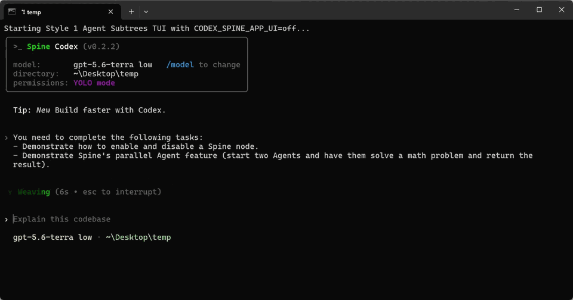
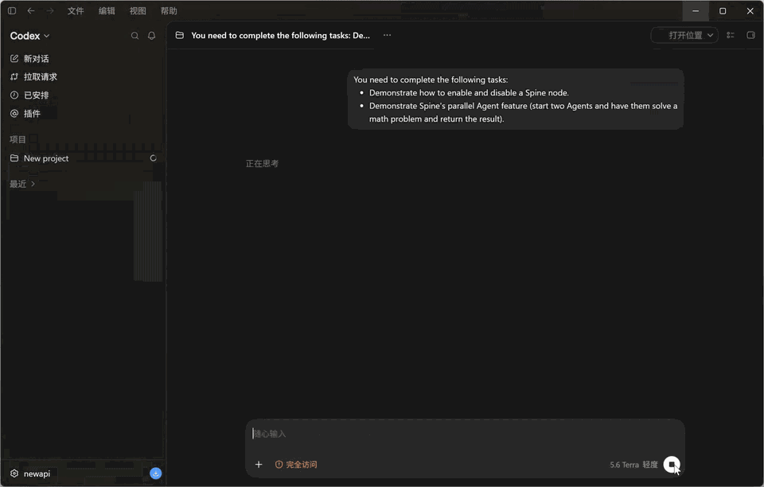
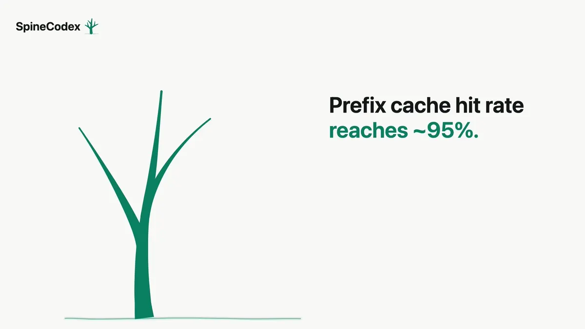

<h1 align="center"> SpineCodex</h1>

<p align="center"><em>Let your Codex work, evolve, and scale on the SpineTree.</em></p>

<p align="center"><a href="https://www.npmjs.com/package/@spinejit/spine-codex"></a> · <a href="./LICENSE"></a></p>

<p align="center">English · <a href="./README.zh-CN.md">简体中文</a></p>

<p align="center">
  
</p>

## Why SpineCodex

SpineCodex gives your Codex a **SpineTree to work on**: long-running,
multi-step work is broken into owned Work Units, persisted by the runtime as
SpineBranches, and refined, delegated, and completed as the tree evolves —
without forcing the entire process into one ever-growing transcript.

### Get started

Install it in your existing Codex environment and run it directly. The current
development branch targets upstream OpenAI Codex `0.153.4`. Published builds
are listed in the [release history](https://github.com/GhabiX/SpineCodex/releases):

```bash
npm install -g @spinejit/spine-codex@latest
spine-codex
```

Spine Spawn is enabled by default. Run `/experimental` to enable the optional
Memory Projection surface, then save and start a new conversation. Set
`spine_spawn.max_concurrent_threads_per_session` in `~/.codex/config.toml` to
configure the total per-session thread limit, including the root thread.

### What this enables

Compared with Codex, SpineCodex resolves **89% more tasks at 27% lower total
cost** on [SWE-Milestone](https://github.com/DeepCommit-ai/SWE-Milestone) and
extends the effective working context by up to **10×**. It also improves the
average score by **10.8 points** on [ProgramBench](https://programbench.com) and
the mean score by **9.2 points** on [FrontierSWE](https://www.frontierswe.com).

| Linear context                                     | SpineCodex                                                                                                                                                                                                                     |
| -------------------------------------------------- | ------------------------------------------------------------------------------------------------------------------------------------------------------------------------------------------------------------------------------ |
| ❌**Run out of context?**                    | ✅**256K → 2.5M Effective Working Context**<br />SpineJIT compiles completed branches into semantic Node Memory, extending effective working context beyond the native window.                                          |
| ❌**Drift after repeated compaction?**       | ✅**Minimum Effective Context. Maximum Focus.**<br />Spine Runtime maintains the SpineTree and projects only the context required by the current Work Unit, keeping the agent focused.              |
| ❌**Lose patience and focus on long tasks?** | ✅**Recursive Subagent Scaling on Demand.**<br />SpineJIT lets the agent recursively unfold into specialized subagents on demand, bringing divide-and-conquer structure and greater reasoning depth to complex problems. |

## What's new in 0.4.1

Targets Codex `0.153.4`, preserving Spine SDK configuration snapshots and history
metadata across sampling and resume. Fixes concurrent Spine branches failing to
start when paginated history contains decimal rate-limit values.

### Upcoming

- **PI and DeepSeek Harness plugins** — SpineSDK integrations in development.
- **App Spine UI** — Inspect and operate the SpineTree, Work Units, and runtime
  state from the Codex App. In development.

<details>
<summary>Preview App Spine UI</summary>

  <p align="center">
    
    <br />
    <sub>Preview — App Spine UI is in development.</sub>
  </p>
</details>

<details>
<summary>Versions</summary>

<details>
<summary>0.3.3</summary>

Improves paginated-session recovery: incompatible historical records no longer
block a valid lineage, while broken files and lineage-boundary errors remain
fatal. Adds regression coverage for malformed rate-limit records during replay.
</details>

<details>
<summary>0.3.2</summary>

Restores the upstream Codex compatibility identity (`0.147.0`) while keeping
the SpineCodex product version independent. Also hardens update-cache
isolation, resumed Spawn visibility, and release metadata checks.
</details>

<details>
<summary>0.3.1</summary>

Separates the SpineCodex update cache from upstream Codex installations so
product updates cannot collide with the upstream client.
</details>

<details>
<summary>0.3.0</summary>

Moves Spine onto a sampling-boundary runtime: Work Units, recursive Spawn,
Node Memory, replay, and projection are coordinated by SpineSDK and surfaced
through the native Codex experience. The runtime owns tree state and context
projection while the agent focuses on the current unit.
</details>

<details>
<summary>0.2.2</summary>

Introduces the public SpineJIT design: compile a linear message stream into a
SpineTree, replace completed branches with Node Memory, and support recursive
subagent scaling. Spine Spawn and Memory Projection were the first experimental
surfaces of that design.
</details>
</details>

## How Spine works

LLMs consume a linear context, but work unfolds recursively.

- **Agent:** works on the current Work Unit.
- **Spine Runtime:** persists Work Units as SpineBranches and composes them into a SpineTree.
- **SpineJIT:** projects the current branch into the linear context required by the next model sample.

```text
Work Unit -> SpineBranch -> SpineTree -> current-branch Context
```

The agent manages work; Spine maintains the recursive state behind the existing
workflow.

## Long-horizon performance

Across three long-horizon coding benchmarks, SpineCodex delivers stronger
outcomes: **1.89× resolved tasks at 27% lower total cost** on SWE-Milestone,
**+10.80pp average score** on ProgramBench, and **+9.2pp mean score** on
FrontierSWE.

<details>
<summary>Benchmark details</summary>

### SWE-Milestone (ICML 2026)

*Long-horizon software development · 80 milestones · GPT-5.6 · sol high*

| System               |     Resolved |        Total cost |
| -------------------- | -----------: | ----------------: |
| BaseCodex            |            9 |           $764.18 |
| **SpineCodex** | **17** | **$556.46** |

**1.89× resolved tasks at 27% lower total cost.**

### ProgramBench

*Whole-repo program reconstruction · Random sample: 50 of 200 tasks · GPT-5.6 · Sol high · conservative cost estimate*

| System               |       Avg. score | Tasks scoring >95% |              Cost |
| -------------------- | ---------------: | -----------------: | ----------------: |
| BaseCodex            |           62.55% |               2/50 |           $188.12 |
| **SpineCodex** | **73.35%** |     **7/50** | **$475.10** |

**+10.80pp average score and 3.5× high-scoring tasks.**

### FrontierSWE

*Ultra-long-horizon coding · 9-task evaluation · GPT-5.6 · high · estimated API cost per trial*

| System               |     Mean score |     Best score |             Cost |
| -------------------- | -------------: | -------------: | ---------------: |
| BaseCodex            |           33.5 |           37.9 |           $20.16 |
| **SpineCodex** | **42.7** | **46.8** | **$37.29** |

**+9.2pp mean score and +8.9pp best score.**

</details>

## How SpineJIT works

**Agent Morphogenesis:** Each task shapes its own context and execution through
just-in-time context-tree compilation and recursive subagent scaling.

**TL;DR:** SpineJIT replaces the live suffix of a context with shorter memory,
while keeping the prefix unchanged so it can continue to hit the prompt cache.

To control this suffix replacement precisely, SpineJIT is implemented as a
just-in-time compilation and context-mapping pipeline:

$$
\text{context messages}
\rightarrow \text{Spine tokens}
\rightarrow \text{SpineTree (ParseStack)}
\rightarrow \text{new context}
$$

The pipeline has two main stages.

### 1. JIT-compile context into a SpineTree

SpineJIT treats a context $C$---a message list, or simply a sentence whose characters are messages---as a stream to compile.

At each sampling boundary, it turns newly appended messages and control events into **Spine tokens** and updates a live LR(0) ParseStack:

SpineJIT uses four token kinds:

$$
\Sigma_{\mathrm{Spine}} = \{\mathrm{Message},\ \mathrm{Open},\ \mathrm{Close},\ \mathrm{SpineSpawnNode}\}
$$

`Message` represents a raw context item. `Open`, `Close`, and
`SpineSpawnNode` are special tokens emitted by SpineJIT at the corresponding
sampling boundaries.

$$
\begin{aligned}
\mathrm{SpineTree} &\to \mathrm{Nodes}\ \mathrm{End} \\
\mathrm{Nodes} &\to \mathrm{Node} \mid \mathrm{Nodes}\ \mathrm{Node} \\
\mathrm{Node} &\to \mathrm{Message} \mid \mathrm{SpineTreeNode} \\
\mathrm{SpineTreeNode} &\to \mathrm{Open}\ \mathrm{Nodes}\ \mathrm{Close} \mid \mathrm{SpineSpawnNode}
\end{aligned}
$$

`End` is only the logical end of a session; a live session never emits it.
Therefore, the ParseStack is the live SpineTree, and the reduction `Open Nodes Close -> SpineTreeNode` turns a closed subtree into one node.

In short, SpineJIT uses LR(0) JIT compilation to map context $C$ to a Spine Tree $PS$:

$$
PS = \mathrm{compile}(C)
$$

### 2. Map the SpineTree into a new context

The structured SpineTree can now be mapped into a shorter context while preserving its stable prefix. For ParseStack $PS$, define:

$$
C' = f(PS) = \prod_{i=0}^{n} h(PS[i])
$$

$$
h(X) =
\begin{cases}
\prod_{x \in X} h(x), & X = \mathrm{Nodes} \\
\mathrm{raw}(X), & X = \mathrm{Message} \\
\mathrm{memory}(X), & X = \mathrm{SpineTreeNode} \\
\mathrm{spine\\_node\\_desc}(X), & X = \mathrm{Open}
\end{cases}
$$

Here, $\prod$ means ordered concatenation.

The mapping is deliberately small:

- `Message` keeps its original content through $\mathrm{raw}(X)$.
- A closed `SpineTreeNode` is replaced by its shorter $\mathrm{memory}(X)$.
- An unmatched `Open` is represented by a concise
  $\mathrm{spine\\_node\\_desc}(X)$, helping the LLM delimit the currently live
  Spine node.

As parsing progresses, completed work in the context suffix is reduced into a `SpineTreeNode` and then projected as memory. Earlier context remains unchanged:

$$
\mathrm{prefix} \cdot \mathrm{suffix}
\longrightarrow
\mathrm{prefix} \cdot \mathrm{memory}
$$

This is the central idea of SpineJIT: compress the context where work has finished, without invalidating the reusable prefix.

### 3. How SpineJIT inserts Spine control tokens

The LLM decides when to open or close a `SpineTreeNode` from the current context. The guiding objective is to maximize the average relevance of the remaining context to the current task.

Here, a **sampling** means one complete processing cycle for a model response: the response itself together with any tool calls it produces.

SpineJIT exposes Spine tools to let the LLM express these decisions. After a successful tool call in a sampling step, SpineJIT inserts the corresponding control token at a precise boundary:

| Tool call       | Inserted token      | Position      |
| --------------- | ------------------- | ------------- |
| `spine.open`  | `Open`            | Pre-sampling  |
| `spine.close` | `Close`           | Pre-sampling  |
| `spine.next`  | `Close Open`      | Pre-sampling  |
| `spine.spawn` | `SpineSpawnNode`s | Post-sampling |

These tokens connect the model's task-boundary decisions to the LR(0) parser, which continuously updates the ParseStack and therefore the context seen by the next sampling step.

<p align="center">
  <a href="./.github/assets/spinecodex-loop.webp">
    
  </a>
  <br />
  <sub>Click to view the full animation.</sub>
</p>

## Citation

A technical report on SpineJIT will be released soon.

If you use SpineCodex in your research, please cite this repository:

```bibtex
@software{xiang2026spinecodex,
  title = {Agent Morphogenesis: Just-in-Time Context Tree Compilation for Cost-Efficient Recursive Subagent Scaling},
  author = {Jiahong Xiang and Kunqiu Chen and Yuqun Zhang},
  year = {2026},
  url = {https://github.com/GhabiX/SpineCodex}
}
```

## Project

SpineCodex is an independently maintained [OpenAI Codex CLI](https://github.com/openai/codex)
(upstream 0.153.4), maintained by [Jiahong Xiang](https://ghabix.github.io)
and [Kunqiu Chen](https://camsyn.github.io).

SpineCodex is licensed under the [Apache-2.0 License](LICENSE). OpenAI Codex
and other derived components retain their attribution in [NOTICE](NOTICE).

## Contributing

We welcome bug reports, issue discussions, and ideas for new features. If you
have a feature or PR idea, please open an issue and reach out to us first so we
can confirm the direction, scope, and compatibility with the current SpineSDK
and upstream Codex version. Please report any bugs through [GitHub Issues](https://github.com/GhabiX/SpineCodex/issues); we will follow up promptly and work toward a fix. You are also welcome to [reach out to me directly](https://ghabix.github.io).
